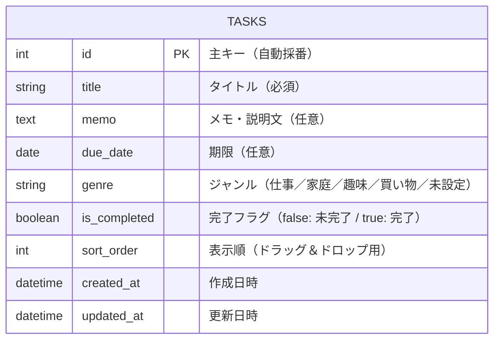

# DB設計

## 1. テーブル一覧

| テーブル名 | 説明 |
|-----------|------|
| tasks | タスク情報を管理するテーブル |

---

## 2. ER図

---

## 3. カラム定義

### tasks テーブル

| カラム名 | 型 | 必須 | 説明 |
|---------|-----|------|------|
| id | INTEGER | ○ | 主キー（自動採番） |
| title | VARCHAR | ○ | タスクのタイトル |
| memo | TEXT | - | メモ・説明文 |
| due_date | DATE | - | 期限日 |
| genre | VARCHAR | - | ジャンル（仕事／家庭／趣味／買い物）、未設定の場合は NULL |
| is_completed | BOOLEAN | ○ | 完了フラグ（デフォルト: false） |
| sort_order | INTEGER | ○ | 表示順（ドラッグ＆ドロップ用） |
| created_at | DATETIME | ○ | 作成日時 |
| updated_at | DATETIME | ○ | 更新日時 |
