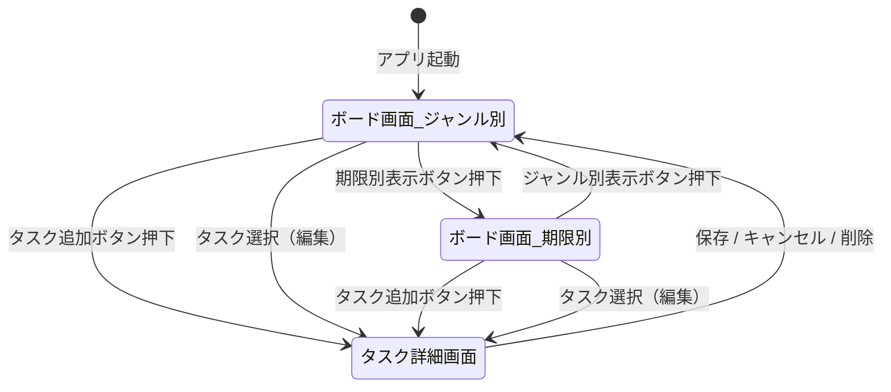

# 画面設計

## 1. 画面一覧

| No. | 画面名 | 説明 |
|-----|--------|------|
| S01 | ボード画面（メイン） | タスク一覧を表示するメイン画面。初期表示はジャンル別。 |
| S02 | タスク詳細画面 | タスクの作成・編集・内容確認を行う画面。 |

---

## 2. 画面遷移図

```mermaid
stateDiagram-v2
    [*] --> ボード画面_ジャンル別: アプリ起動

    ボード画面_ジャンル別 --> タスク詳細画面: タスク追加ボタン押下
    ボード画面_ジャンル別 --> タスク詳細画面: タスク選択（編集）
    ボード画面_ジャンル別 --> ボード画面_期限別: 期限別表示ボタン押下

    ボード画面_期限別 --> タスク詳細画面: タスク追加ボタン押下
    ボード画面_期限別 --> タスク詳細画面: タスク選択（編集）
    ボード画面_期限別 --> ボード画面_ジャンル別: ジャンル別表示ボタン押下

    タスク詳細画面 --> ボード画面_ジャンル別: 保存 / キャンセル / 削除
```
