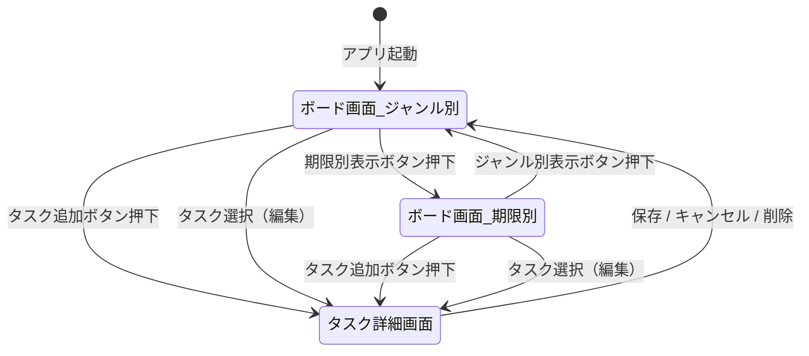
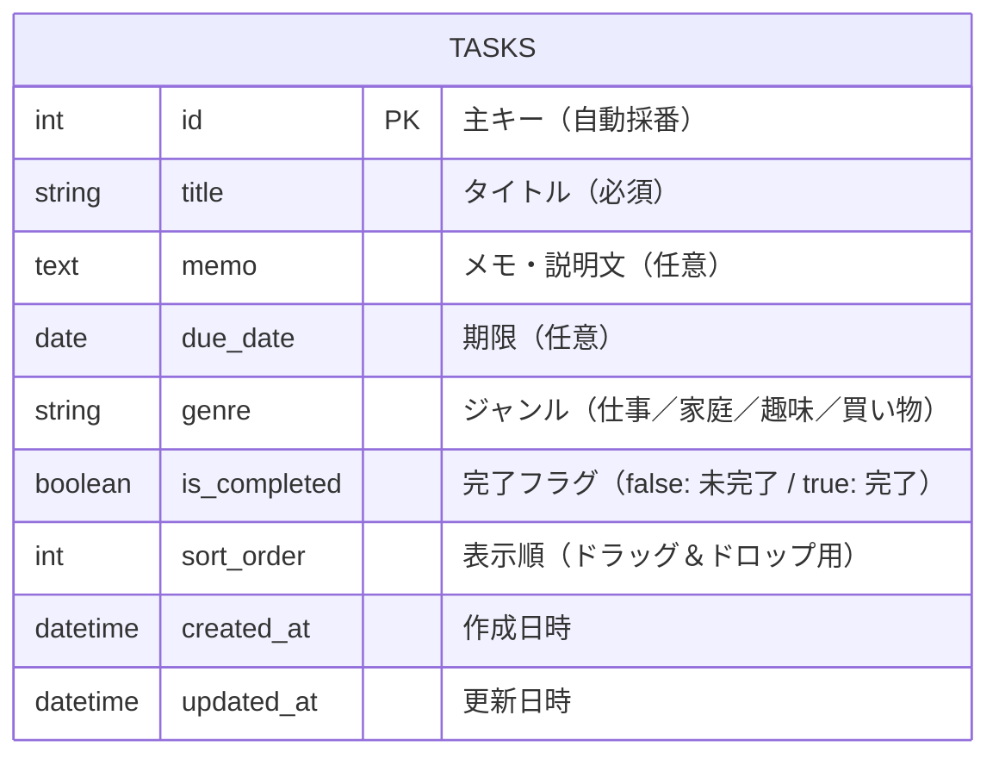

# 要件定義書

## 1. プロジェクト概要

| 項目 | 内容 |
|------|------|
| アプリ名 | TaskManagement |
| 対象ユーザー | 個人（自分専用） |
| 目的 | タスクの作成・管理・振り返りができる個人用タスク管理アプリ |
| 参考サービス | Trello |

---

## 2. 背景・課題

日々のタスクを頭の中だけで管理していると、「やるべきことを忘れる」「期限が把握できない」「何が終わったか分からない」といった問題が生じる。  
本アプリでは、タスクを可視化・整理することで、個人の生産性向上を目的とする。

---

## 3. 機能要件

### 3-1. タスク機能

| No. | 機能 | 説明 |
|-----|------|------|
| F01 | タスク作成 | タスクを新規作成できる |
| F02 | タスク編集 | 登録済みのタスクを編集できる |
| F03 | タスク削除 | 登録済みのタスクを削除できる |
| F04 | タスク完了 | タスクに完了チェックをつけられる |
| F05 | 完了済み移動 | 完了チェックをつけたタスクは「完了済みエリア」に移動する |

#### タスクに登録できる情報

| 項目 | 必須/任意 | 説明 |
|------|----------|------|
| タイトル | 必須 | タスクの名前 |
| メモ・説明文 | 任意 | タスクの詳細や補足 |
| 期限（日付） | 任意 | タスクの締め切り日 |
| ジャンル | 任意 | 仕事・家庭・趣味・買い物 から選択 |

---

### 3-2. 表示・操作機能

| No. | 機能 | 説明 |
|-----|------|------|
| F06 | ジャンル別表示 | タスクをジャンル（仕事・家庭・趣味・買い物）ごとに分けて表示する（初期表示） |
| F07 | 期限別表示への切り替え | ボタン操作で期限別の表示に切り替えられる |
| F08 | ドラッグ＆ドロップ | タスクをドラッグ＆ドロップで移動・並び替えできる |

#### 期限別表示の区分

| 区分 | 条件 |
|------|------|
| 今日やること | 期限が今日のタスク |
| 今週やること | 期限が今週中（今日を除く）のタスク |
| それ以降 | 期限が来週以降のタスク |
| 期限なし | 期限が設定されていないタスク |

---

## 4. 非機能要件

| 項目 | 内容 |
|------|------|
| 対象環境 | Webブラウザ（PC） |
| 認証 | 不要（個人使用のため） |
| 操作性 | シンプルで直感的な UI にする |
| 拡張性 | 初期リリース後に機能追加がしやすい設計にする |
| パフォーマンス | タスク一覧の表示・操作が 1 秒以内に完了すること |
| データ保存 | タスクデータはデータベースに永続化する |
| ブラウザ対応 | Google Chrome 最新版を主な対象とする |
| セキュリティ | 個人使用のため最低限の対策とする（XSS 対策など基本的なもの） |

---

## 5. ユースケース

| No. | ユースケース名 | 説明 |
|-----|--------------|------|
| UC01 | タスクを作成する | ユーザーがタスク詳細画面でタイトル等を入力し、新しいタスクを登録する |
| UC02 | タスクを編集する | ユーザーが既存タスクを選択し、内容を変更して保存する |
| UC03 | タスクを削除する | ユーザーが不要なタスクを削除する |
| UC04 | タスクを完了にする | ユーザーがタスクに完了チェックをつけ、完了済みエリアへ移動させる |
| UC05 | ジャンル別に表示する | ユーザーがボード画面でタスクをジャンルごとに分けて確認する（初期表示） |
| UC06 | 期限別に表示する | ユーザーが表示切り替えボタンを押して期限別のグループ表示に切り替える |
| UC07 | タスクを並び替える | ユーザーがドラッグ＆ドロップでタスクの順番を変更する |

---

## 6. 画面一覧

| No. | 画面名 | 説明 |
|-----|--------|------|
| S01 | ボード画面（メイン） | タスク一覧を表示するメイン画面。初期表示はジャンル別。 |
| S02 | タスク詳細画面 | タスクの作成・編集・内容確認を行う画面。 |

---

## 7. 画面遷移

### 画面遷移図

---

## 8. DB設計（ER図）

### テーブル一覧

| テーブル名 | 説明 |
|-----------|------|
| tasks | タスク情報を管理するテーブル |

### ER図

---

## 9. スコープ外（対象外機能）

以下の機能は今回のスコープ外とする。必要に応じて将来的に追加を検討する。

- ログイン・認証機能
- 複数ユーザーでの共有・コラボレーション機能
- タスクの優先度設定
- 期限の時間単位指定
- 通知・リマインダー機能

---

## 10. 用語定義

| 用語 | 説明 |
|------|------|
| タスク | ユーザーが管理するひとつの作業・やること |
| ジャンル | タスクの種類（仕事・家庭・趣味・買い物） |
| ボード | タスクをまとめて表示するエリア |
| 完了済みエリア | 完了チェックをつけたタスクが移動する表示エリア |

---

## 11. 改訂履歴

| バージョン | 日付 | 内容 |
|-----------|------|------|
| 1.0 | 2026-04-24 | 初版作成 |
| 1.1 | 2026-04-24 | ユースケース・画面遷移図（Mermaid）・ER図・非機能要件を追加 |
